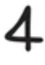
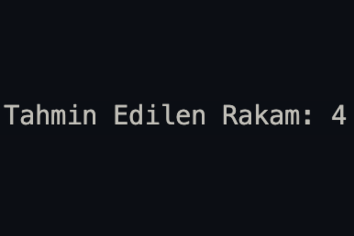

# MNIST El Yazısı Rakam Tanıma Projesi


*Girdi: Ham el yazısı rakam görüntüsü*


*İşlenmiş: HOG özellikleri + ham piksel verisi*


*Tahmin: Modelin tahmin ettiği rakam*

Bu proje, MNIST veri seti kullanarak el yazısı rakamları (0-9) tanıyan bir makine öğrenmesi modeli geliştirmeyi amaçlamaktadır.

## Proje Açıklaması

İlk başta sadece ham pixel değerleri kullanılarak model eğitildi. Ancak bazı rakamlar arasında karışıklıklar yaşandığı için ham pixel değerleri ile HOG (Histogram of Oriented Gradients) özellik çıkarma yöntemi birleştirilerek model performansı artırıldı.

## Kullanılan Teknolojiler

- **Python**
- **scikit-learn** - SVM modeli için
- **NumPy** - Veri işleme
- **scikit-image** - HOG özellik çıkarma
- **joblib** - Model kaydetme

## Veri Seti

MNIST veri seti kullanılmıştır:
- **Eğitim verisi**: 60,000 adet 28x28 piksel rakam görüntüsü
- **Test verisi**: 10,000 adet 28x28 piksel rakam görüntüsü

## Özellik Çıkarma Yöntemleri

### 1. Ham Pixel Değerleri
- 28x28 piksel görüntüler düzleştirilerek 784 boyutlu vektöre dönüştürüldü
- Pixel değerleri 0-1 arasında normalize edildi

### 2. HOG (Histogram of Oriented Gradients)
- Görüntülerdeki kenar ve şekil bilgilerini yakalamak için kullanıldı
- Parametreler:
  - `orientations=9`
  - `pixels_per_cell=(8,8)`
  - `cells_per_block=(2,2)`
  - `block_norm='L2-Hys'`

### 3. Hibrit Yaklaşım
Ham pixel değerleri + HOG özellikleri birleştirilerek daha zengin bir özellik vektörü oluşturuldu.

## Model

**Support Vector Machine (SVM)** algoritması kullanılarak sınıflandırma gerçekleştirildi.

## Kurulum ve Çalıştırma

```bash
# Gerekli kütüphaneleri yükleyin
pip install numpy scikit-learn scikit-image joblib

# Kodu çalıştırın
python mnist_svm.py
```

## Sonuçlar

HOG özellik çıkarma yöntemi eklendikten sonra model performansında iyileşme gözlendi.

## Bilinen Sorunlar ve Gelecek İyileştirmeler

### Karışan Rakamlar
Bazı rakam çiftleri hala birbirine karışmaktadır:
- **1 ve 7** rakamları
- **9 ve 0** rakamları

### İyileştirme Önerileri
Bu sorunları çözmek için aşağıdaki yöntemler denenebilir:

1. **Daha Gelişmiş Özellik Çıkarma**
   - LBP (Local Binary Patterns)
   - SIFT/SURF özellikleri
   - Derin öğrenme tabanlı özellikler

2. **Model Parametreleri**
   - SVM kernel parametrelerini optimize etme
   - Farklı kernel türleri deneme (RBF, polynomial)

3. **Veri Artırma**
   - Görüntü rotasyonu
   - Gürültü ekleme
   - Ölçeklendirme

4. **Farklı Algoritmalar**
   - Random Forest
   - CNN (Convolutional Neural Networks)
   - Ensemble yöntemleri

## İletişim

Bu sorunlar için önerileriniz varsa lütfen benimle iletişime geçin.

## Dosya Yapısı

```
handwritten_digit_recognition/
├── data/
│   ├── train-images.idx3-ubyte
│   ├── train-labels.idx1-ubyte
│   ├── t10k-images.idx3-ubyte
│   └── t10k-labels.idx1-ubyte
├── mnist_svm.py
├── svm_mnist_pixel_hog_model.joblib
└── README.md
```
